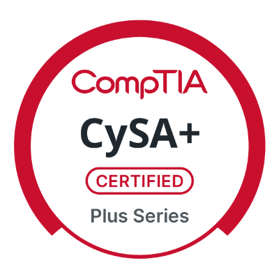
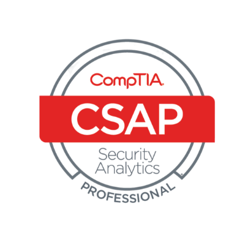
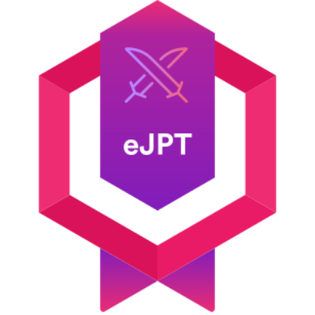
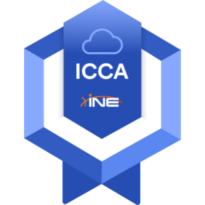
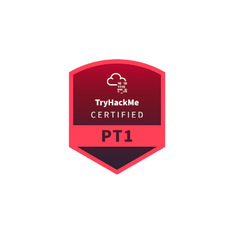

# 👋 Hi, I’m Wadie!

---

## 🔐 About Me

I am a cybersecurity engineering enthusiast developing expertise across multiple domains of information security.

With practical experience from internships and personal projects, I adopt a versatile approach that integrates security principles, risk management, and practical technical skills.

Continuously learning and growing, I aim to contribute to impactful security initiatives.

This GitHub profile presents a curated selection of my projects, labs, and research, demonstrating my commitment to applying both theory and practice in the evolving field of cybersecurity.

---

## 🎓 Certifications

---

## 🧪 Featured Projects

| Project                                                      | Description                                                                                                         | Link                                            |
|--------------------------------------------------------------|---------------------------------------------------------------------------------------------------------------------|-------------------------------------------------|
| Automated Malware Analysis and Digital Forensics Pipeline with Machine Learning | Developed a malware analysis and forensics pipeline using Cuckoo sandbox, ML-based classification, and automated artifact collection. | [Repository](https://github.com/Wadie-MAJIDI/SentriX/) |
| Design and Implementation of a Decentralized IAM Prototype Based on Self-Sovereign Identity                                         | Implementation of Decentralized IAM Using W3C Decentralized Identifiers (DIDs) and Verifiable Credentials (VCs)                                                        | [Repository](https://github.com/Wadie-MAJIDI/DIAM)         |
| Secure Network Architecture with Real-Time Honeypot on Raspberry Pi | Built a secure network setup exposing a Raspberry Pi honeypot over 4G using a reverse proxy to bypass CG-NAT, with network isolation and IDS/IPS monitoring. | [Repository](https://github.com/wadie-MAJIDI/HONEYPI)     |
| Automated Security Solution Integrating EDR and SOAR       | Integrated LimaCharlie (EDR), Tines (SOAR), and Slack to automate alerting, host isolation, and incident response.   | [Repository](https://github.com/Wadie-MAJIDI/SOAR)      |
| Cloud-Based SIEM Implementation and Optimization           | Configured a cloud-based SIEM with IDS integration and tested OWASP Top 10 threats to optimize detection and correlation rules. | [Repository](https://github.com/Wadie-MAJIDI/SIEM)   |
| Secure Messaging App                              | Built an end-to-end encrypted chat app using RSA for key exchange and AES for data encryption.                      | [Repository](https://github.com/wadie-majidi/Secure-Chat)      |

---

Crafted with purpose and precision — building security that matters.
